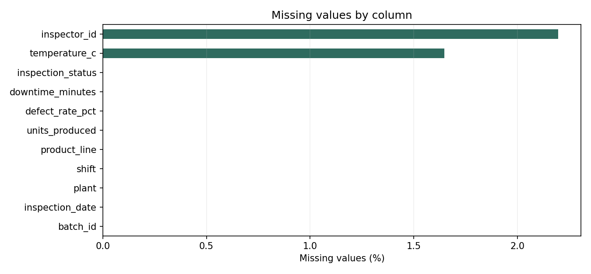
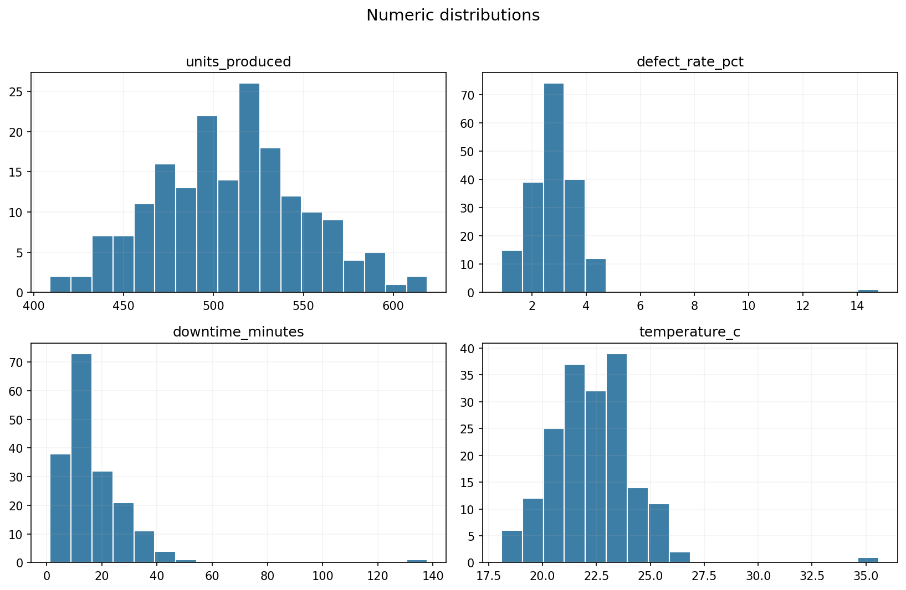

# Data Quality Report: sample_manufacturing_quality.csv

## Executive summary

**Status:** Review recommended

- Rows: **182**
- Columns: **11**
- Missing cells: **7**
- Rows in duplicate groups: **4**
- Invalid typed values: **4**
- Potential outliers: **9**

Potential outliers and invalid values are review flags, not automatic deletion decisions.

## Column profile

| column | dtype | non_null_count | missing_count | missing_percent | unique_count | mean | median | min | max | std |
| --- | --- | --- | --- | --- | --- | --- | --- | --- | --- | --- |
| batch_id | object | 182 | 0 | 0.0 | 180 | — | — | — | — | — |
| inspection_date | object | 182 | 0 | 0.0 | 180 | — | — | — | — | — |
| plant | object | 182 | 0 | 0.0 | 3 | — | — | — | — | — |
| shift | object | 182 | 0 | 0.0 | 3 | — | — | — | — | — |
| product_line | object | 182 | 0 | 0.0 | 3 | — | — | — | — | — |
| inspector_id | object | 178 | 4 | 2.2 | 5 | — | — | — | — | — |
| units_produced | object | 182 | 0 | 0.0 | 106 | 509.309 | 509.0 | 409.0 | 619.0 | 41.731 |
| defect_rate_pct | object | 182 | 0 | 0.0 | 135 | 2.833 | 2.79 | 0.88 | 14.8 | 1.178 |
| downtime_minutes | object | 182 | 0 | 0.0 | 143 | 17.098 | 15.0 | 1.2 | 138.0 | 13.226 |
| temperature_c | float64 | 179 | 3 | 1.65 | 71 | 22.352 | 22.3 | 18.1 | 35.6 | 1.985 |
| inspection_status | object | 182 | 0 | 0.0 | 3 | — | — | — | — | — |

## Type validation

| column | expected | invalid | examples |
| --- | --- | --- | --- |
| inspection_date | date | 1 | 2025-02-30 |
| units_produced | integer | 1 | five hundred |
| defect_rate_pct | numeric | 1 | n/a? |
| downtime_minutes | numeric | 1 | unknown |

## Potential outliers

| column | potential outliers | lower bound | upper bound | CSV rows |
| --- | --- | --- | --- | --- |
| units_produced | 1 | 399.0 | 615.0 | 50 |
| defect_rate_pct | 1 | 0.605 | 4.885 | 44 |
| downtime_minutes | 6 | -7.0 | 37.8 | 22, 58, 59, 87, 98, 103 |
| temperature_c | 1 | 17.5 | 27.1 | 163 |

## Visual review

## Interpretation notes

- Missingness may be legitimate; investigate the collection process before filling or dropping values.
- Duplicate counts include every member of a duplicate group so the report shows the full review scope.
- Type validation uses declared expectations from the configuration file.
- Outliers use the 1.5 × IQR rule. They may be valid rare events and should be checked with domain context.
